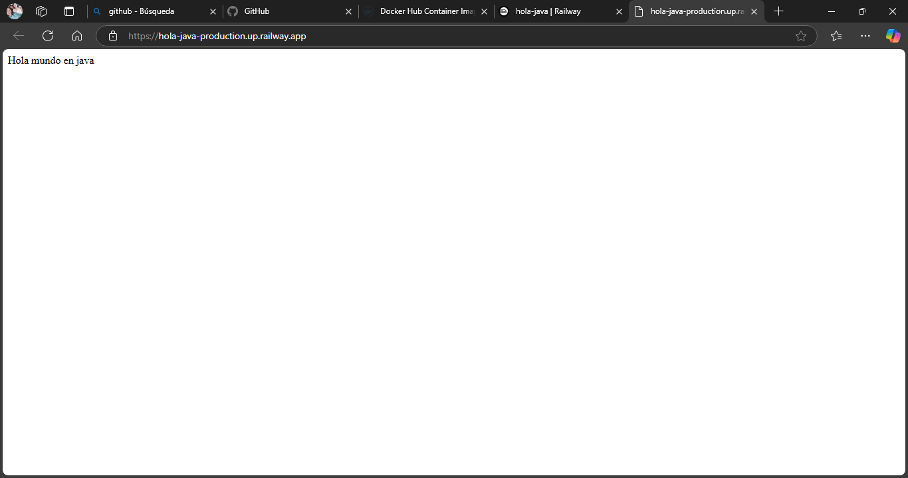

# HOLA MUNDO EN JAVA
## Overview  
This project is a basic "Hello World" application created with the Spring Framework. It provides a simple demonstration of how to set up a Spring application, build a basic REST controller, and handle HTTP requests to output a "Hello, World!" message.

## Features  
- **Minimal Configuration**: Utilizes Spring Boot’s auto-configuration to minimize the need for boilerplate code.  
- **Spring Boot Setup**: Shows a basic Spring Boot application setup, including managing dependencies and configuring the main class.

## Built With  
- Spring Boot  
- Docker

## Getting Started  
### Prerequisites  
Ensure that the following tools are installed on your system before starting:  
- Java 17 or later – [Download Java](https://www.oracle.com/java/technologies/javase-jdk17-downloads.html)  
- Spring Boot 3.3.2 – [Spring Boot Documentation](https://docs.spring.io/spring-boot/docs/3.3.2/reference/html/getting-started.html)  
- Maven – [Maven](https://maven.apache.org/)

If any of these tools are missing, follow the links to install them.

### Installation  
1. Clone the repository:  
   https://github.com/XavierQu23/hola-java.git
  
## Build the project with Maven:
bash
Copiar código
mvn clean install

## Running the Service
To start the service:

bash
Copiar código
mvn spring-boot:run

## Then, open a browser and visit:

makefile
Copiar código
localhost:8003

## Running with Docker
Pull or build the Docker image:
docker pullxavi1920/holaenjava:version3  
docker build -t <any-name> .
docker run -p 8003:8003 xavi1920/holaenjava:version3  # or <any-name>

## RESULTS

https://hola-java-production.up.railway.app/

